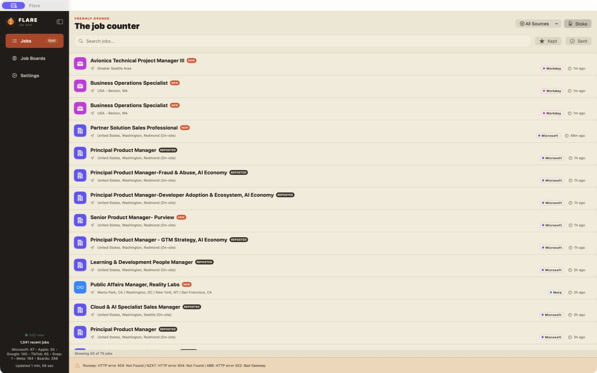
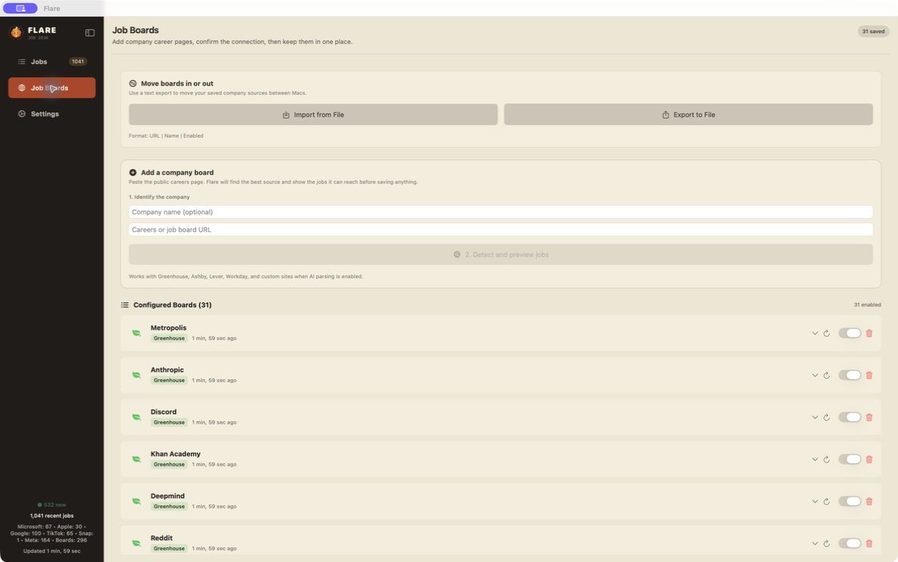
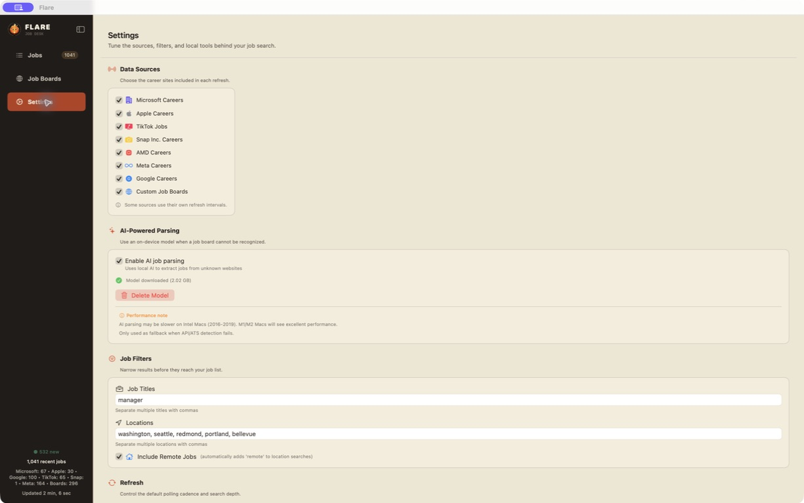

(Not so) Extremely simple (anymore) job posting monitoring tool for Microsoft (now also TikTok, Snap, Meta). Displays jobs from the [https://careers.microsoft.com/](https://careers.microsoft.com/) for the past 24 hours, sends a notification when a new job posting is created. New update now allows you to paste a careers page link, automatically scan the site and detect the ATS that the company uses, adding it to the list of job sources to scan. Greenhouse, Ashby, Lever, Workday ATS boards are fully supported. V1 also brings in the functionality to properly scrape Meta's GraphQL api and had been tested successfully so far. Search is performed using the job title and location.

Current backlog: implement more ATS boards, address some performance issues, unify addition of new fetchers (so I don't have to add a new fetcher in 15 different places), but other than that it performs exactly what I needed for myself.

Bundle version is coming out as soon as the auto updater is properly tested.

That was the original version of Flare. It has grown quite a bit since then, although the idea is still the same: show me the jobs I care about without making me visit a pile of careers pages every day.

As of v1.10, the main view is a proper job desk with source, title and location filtering, kept and applied states, new/reposted labels, job details, pagination for larger caches and a sidebar that shows what each refresh actually found. The built-in sources now include Microsoft, Apple, Google, TikTok, Snap, AMD and Meta alongside saved company boards.

Adding a board is now a small flow instead of a blind URL save. Paste the public careers page, let Flare detect the ATS or usable API route, preview the jobs it can reach and then save it. Saved boards can be enabled, tested, inspected, removed, imported and exported. Greenhouse, Ashby, Lever, Workday, BambooHR, iCIMS and Taleo have dedicated handling; unknown sites go through the simple HTML/API extraction path first and can fall back to an optional local AI model when that is enabled. The AI model stays on the Mac and is only used when the cheaper detection paths do not get a usable result.

There is also a settings view for sources, title/location filters, refresh depth and timing, the local model, automatic Sparkle updates and clearing the local job cache without touching boards, settings, kept jobs or the model. So yes, the bundle version did eventually happen.

Current v1.10 job desk:

Job board flow:

Settings:

[Privacy policy](PRIVACY.md)
